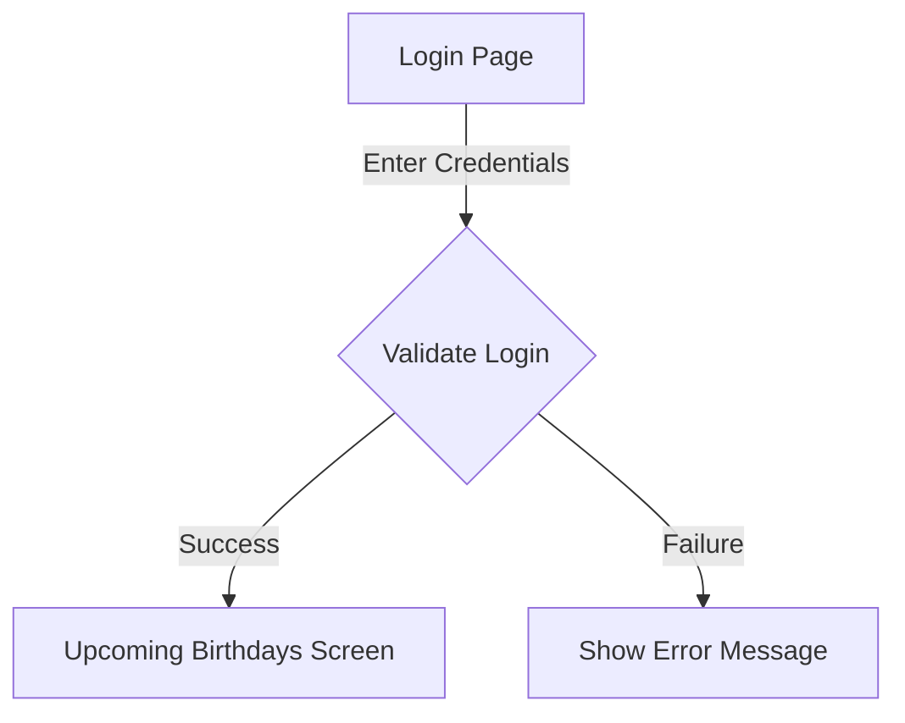
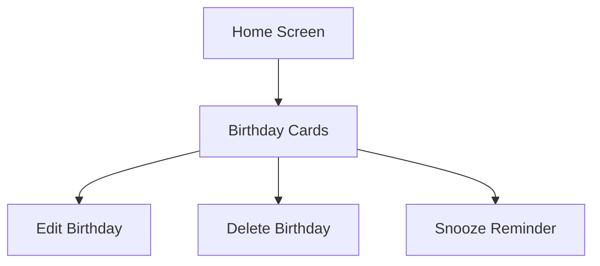
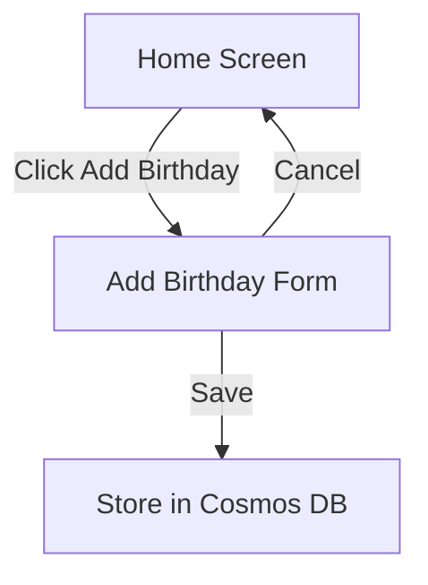
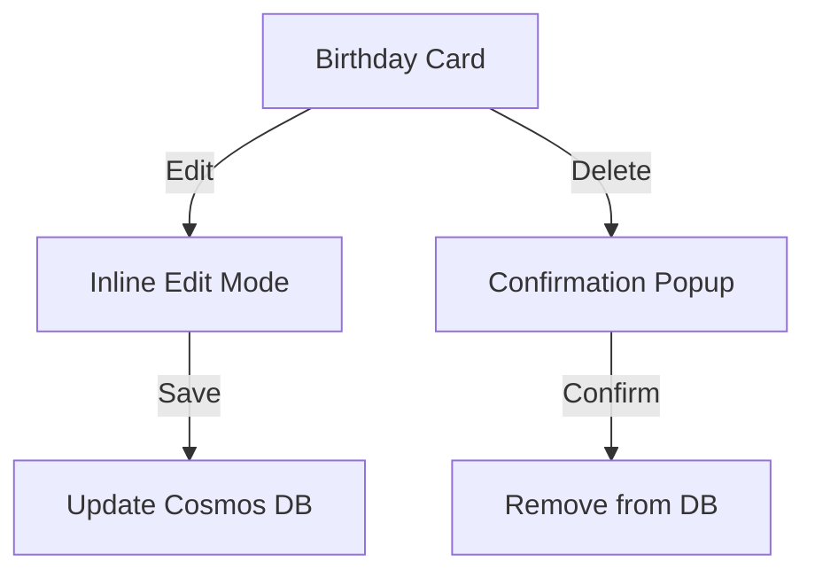
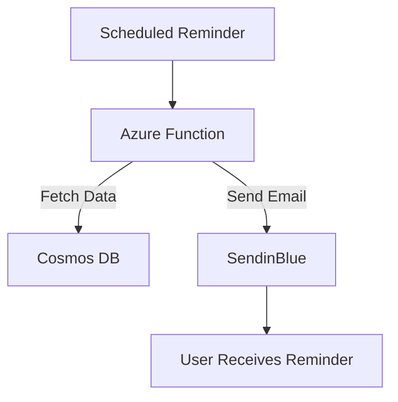

# Functional Design Document (FDD)

**Project Name:** Birthday Reminder Web App  
**Prepared By:** Ashish  
**Date:** 2025-08-29  

---

## 1. Introduction
The Birthday Reminder Web App is designed to help users manage and receive reminders for birthdays. This FDD details the functional design, focusing on **screen flows, usability, and user interactions**.

---

## 2. User Flows & Screen Designs

### 2.1 Login Flow
- **Screen Elements:**
  - Username field
  - Password field
  - Login button
  - Error message on invalid login



---

### 2.2 Upcoming Birthdays (Home Screen)
- **Design Choice:** Card-based view grouped by timeframe.
- **Screen Elements:**
  - Header: "Upcoming Birthdays"
  - Groups: This Week / Next 2 Weeks / Later
  - Cards per person: Name, DOB, Age, Quick buttons (Edit, Delete, Snooze)



---

### 2.3 Add Birthday Flow
- **Design Choice:** Configurable reminders.
- **Screen Elements:**
  - Fields: Name, Date of Birth, Reminder Setting (dropdown)
  - Buttons: Save, Cancel



---

### 2.4 Edit & Delete Birthday Flow
- **Design Choice:** Inline edit on cards + simple delete confirmation.

- **Edit:**
  - User clicks **Edit** → Card fields become editable.
  - User saves → Updates Cosmos DB.

- **Delete:**
  - User clicks **Delete** → Confirmation popup.
  - On confirm → Record removed.



---

### 2.5 Reminder Emails
- **Design Choice:** Styled but simple HTML.
- **Email Structure:**
  - Subject: “🎉 Don’t forget [Name]’s Birthday!”
  - Body: Name, Date, Reminder timing (e.g., same day / 1 day before / 1 week before)
  - Sent via Azure Functions → SendinBlue API



---

## 3. Screen Wireframes (Textual Representation)

**Login Page**  
```
+-----------------------+
|   Birthday Reminder   |
+-----------------------+
| Username: [       ]  |
| Password: [       ]  |
| [ Login ]            |
| Error shown here     |
+-----------------------+
```

**Upcoming Birthdays (Cards View)**  
```
========================
This Week
------------------------
Name: John Doe   Age: 25
Birthday: 02 Sep
[Edit] [Delete] [Snooze]
========================
Next 2 Weeks
------------------------
Name: Jane Smith Age: 30
Birthday: 10 Sep
[Edit] [Delete] [Snooze]
```

**Add Birthday Form**  
```
+----------------------------+
| Add Birthday               |
+----------------------------+
| Name: [            ]       |
| DOB:  [ dd-mm-yyyy ]       |
| Reminder: [Dropdown ▼]     |
| [ Save ]  [ Cancel ]       |
+----------------------------+
```

---

## 4. Functional Requirements Mapping

| Requirement | Design Choice |
|-------------|---------------|
| Authentication | Minimal login (username + password) |
| Birthday List | Card-based grouped list with quick actions |
| Add Birthday | Name, DOB, reminder setting |
| Edit Birthday | Inline edit on card |
| Delete Birthday | Confirmation popup |
| Reminders | Styled but simple HTML email via SendinBlue |

---

## 5. Usability Considerations
- Minimalist design, mobile-friendly.
- Quick actions on cards for efficiency.
- Clear error messages for login.
- Simple confirmation modals for deletes.

---

## 6. Technical Integration Points
- **Frontend:** React (Azure Static Web Apps)
- **Backend:** Azure Functions (Node.js)
- **Database:** Cosmos DB
- **Email Service:** SendinBlue API

---

## 7. Conclusion
This functional design ensures a **clean, minimal UI**, intuitive **card-based flows**, and reliable **email reminders**, meeting the original requirements while focusing on **usability** and **simplicity**.

